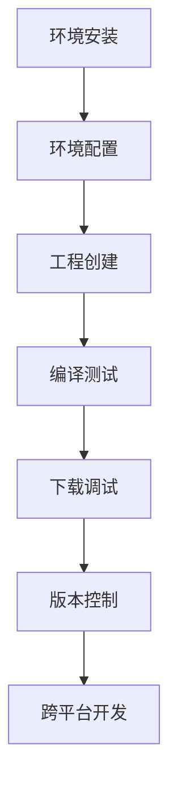

# STM32开发环境搭建指南（CMake + VSCode + Ozone）

本文详细介绍了基于STM32的开发环境搭建流程，使用**CMake + VSCode + Ozone**作为核心工具链，支持Windows和Linux双平台开发。

## 目录
- [工具链概述](#工具链概述)
- [环境安装](#环境安装)
- [环境配置](#环境配置)
- [工程创建与测试](#工程创建与测试)
- [编译与下载](#编译与下载)
- [调试与Ozone使用](#调试与ozone使用)
- [版本控制与Git](#版本控制与git)
- [Linux兼容性](#linux兼容性)

## 工具链概述

本方案采用现代化的开发工具链：
- **STM32CubeMX**：芯片初始化与配置
- **VSCode**：代码编辑与项目管理
- **CMake + Ninja**：项目构建系统
- **J-Link + Ozone**：程序下载与调试
- **Git**：版本控制

优势：
- 跨平台支持（Windows/Linux）
- 高效编译（Ninja并行构建）
- 专业调试（Ozone实时变量监控）
- 版本控制友好

## 环境安装

### Windows平台安装步骤

1. **网络加速准备**：
   - 下载[Steam++](https://steampp.net/)
   - 启用GitHub加速功能

2. **核心软件安装**：
   | 软件 | 下载地址 | 备注 |
   |------|----------|------|
   | VSCode | [官网下载](https://code.visualstudio.com/Download) | 选择Windows版本 |
   | STM32CubeMX | [ST官网](https://www.stmcu.com.cn/Designresource/detail/software/711298) | 需ST账号登录 |
   | J-Link | [SEGGER官网](https://www.segger.com/downloads/jlink/) | 推荐v7.96+ |
   | Ozone | [SEGGER官网](https://www.segger.com/products/development-tools/ozone-j-link-debugger/) | 调试器 |
   | Git | [官网下载](https://git-scm.com/downloads) | 版本控制 |
   | MSYS2 | [官网下载](https://www.msys2.org/) | MinGW环境 |
   | CMake | [GitHub发布](https://github.com/Kitware/CMake/releases) | 推荐v4.0+ |
   | Ninja | [GitHub发布](https://github.com/ninja-build/ninja/releases) | 构建工具 |

3. **MSYS2环境配置**：
   ```bash
   pacman -S mingw-w64-x86_64-toolchain 
   pacman -S mingw-w64-x86_64-arm-none-eabi-toolchain
   pacman -S mingw-w64-x86_64-ccache
   pacman -S mingw-w64-x86_64-openocd
   ```

### Linux平台安装步骤
```bash
# 安装基础工具
sudo apt update
sudo apt install cmake ninja-build

# 安装J-Link
sudo dpkg -i JLink_Linux_V842_x86_64.deb

# 安装STM32CubeMX（下载Linux版）
# 配置VSCode（见环境配置章节）
```

## 环境配置

### 系统环境变量（Windows）
添加以下路径到系统PATH：
1. JFlash.exe所在目录
2. MSYS2的mingw64/bin目录
3. CMake的bin目录
4. Ninja可执行文件目录

### VSCode配置
在`settings.json`中添加：
```json
{
  "terminal.integrated.profiles.windows": {
    "mysys2-mingw64": {
      "path": "cmd.exe",
      "args": ["/c", "D:\\msys64\\msys2_shell.cmd -defterm -mingw64 -no-start -here"]
    }
  },
  "terminal.integrated.defaultProfile.windows": "mysys2-mingw64",
  "cmake.configureOnOpen": true,
  "cmake.sourceDirectory": "${workspaceFolder}",
  "cmake.buildDirectory": "${workspaceFolder}/build",
  "cmake.generator": "Ninja",
  "cmake.cmakePath": "D:\\Program Files\\CMake\\bin\\cmake.exe",  // Windows路径
  "cmake.ninjaPath": "D:\\Tools\\ninja.exe"  // Windows路径
}
```
> **注意**：Linux用户需修改路径为对应系统路径

### Git全局配置
```bash
git config --global user.name "YourName"
git config --global user.email "your.email@example.com"
git config --global http.sslVerify false  # 解决SSL证书问题
```

## 工程创建与测试

### STM32CubeMX配置
1. 登录ST账号（右上角ST徽标）
2. 安装芯片支持包：STM32F1/F4/H7系列
3. 创建新工程：
   - 选择MCU型号（如STM32F103C8T6）
   - 配置SYS（Debug模式）
   - 配置RCC时钟
   - 设置时钟树
4. 项目设置：
   - 指定工程位置
   - **工具链选择CMake**
   - 生成代码

### 工程编译测试
```powershell
# 在工程目录中
mkdir build
cd build
cmake .. -G Ninja  # 使用Ninja生成器
ninja -v          # 详细编译输出
```
成功标志：在build目录生成`工程名.elf`文件

## 编译与下载

### HEX文件生成
在CMakeLists.txt中添加：
```cmake
set(ELFFILE ${CMAKE_PROJECT_NAME}.elf)
set(HEXFILE ${CMAKE_PROJECT_NAME}.hex)
set(OBJCOPY arm-none-eabi-objcopy.exe)

add_custom_command(
  TARGET ${CMAKE_PROJECT_NAME}
  POST_BUILD
  COMMAND ${OBJCOPY} -O ihex ${ELFFILE} ${HEXFILE}
)
```

### J-Link自动下载
```cmake
set(JFLASH "jflash.exe")

add_custom_command(
  TARGET ${CMAKE_PROJECT_NAME}
  POST_BUILD
  COMMAND ${OBJCOPY} -O ihex ${ELFFILE} ${HEXFILE}
  COMMAND ${JFLASH} -openprj ${CMAKE_SOURCE_DIR}/stm32.jflash 
           -open ${HEXFILE},0x08000000 -auto -startapp -exit
)
```
> **注意**：`0x08000000`为STM32F1的Flash起始地址，其他型号需调整

### Makefile下载方案
```makefile
download_jlink:
    JFlash -openprj ${CMAKE_SOURCE_DIR}/stm32.jflash \
           -open ${CMAKE_PROJECT_NAME}.hex,0x08000000 \
           -auto -startapp -exit
```
使用命令：
```powershell
mingw32-make download_jlink
```

## 调试与Ozone使用

Ozone提供专业级调试功能：
1. **实时变量监控**：
   - 查看/修改变量值
   - 监控外设寄存器
   
2. **数据跟踪**：
   ```mermaid
   graph LR
   A[变量监控] --> B[波形显示]
   B --> C[CSV导出]
   C --> D[MATLAB分析]
   ```

3. **高级调试功能**：
   - 条件断点
   - 数据断点
   - 实时表达式评估
   - 调用栈分析

## 版本控制与Git

### 工程提交到GitHub
1. VSCode中打开源代码管理视图（Ctrl+Shift+G）
2. 初始化仓库
3. 暂存更改（+按钮）
4. 提交并添加描述
5. 发布到GitHub（选择public/private）

### 常见问题解决
```bash
# 首次拉取后编译失败
rm -rf build      # 清除旧构建
mkdir build && cd build
cmake .. -G Ninja
ninja
```

## Linux兼容性

### 特殊配置项
1. **网络工具**：
   - Steam++(Watt)：<https://steampp.net>
   - Clash Verge：<https://clashverge.net>

2. **VSCode配置**：
   ```json
   {
     "cmake.cmakePath": "/usr/bin/cmake",
     "cmake.ninjaPath": "/usr/bin/ninja"
   }
   ```

3. **安装依赖**：
   ```bash
   sudo apt install libusb-1.0-0-dev  # J-Link依赖
   ```

### 开发流程差异
| 步骤 | Windows | Linux |
|------|---------|-------|
| 环境安装 | 图形安装包 | apt/dpkg |
| 路径分隔符 | `\` | `/` |
| 终端环境 | MSYS2 | 系统终端 |
| 权限管理 | 一般不需要sudo | 需要sudo授权 |

> **提示**：Linux下开发流程与Windows基本一致，主要区别在于路径和权限管理

## 技术支持
遇到问题可咨询：[DeepSeek技术支持](https://www.deepseek.com)

