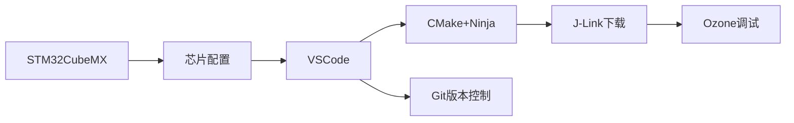

# STM32开发环境搭建指南（CMake + VSCode + Ozone）

本指南详细说明了在Windows和Linux系统下搭建STM32开发环境的完整流程，采用现代化的工具链组合。

## 目录
- [STM32开发环境搭建指南（CMake + VSCode + Ozone）](#stm32开发环境搭建指南cmake--vscode--ozone)
  - [目录](#目录)
  - [工具链概述](#工具链概述)
  - [Windows环境搭建](#windows环境搭建)
    - [Windows软件安装](#windows软件安装)
    - [Windows环境配置](#windows环境配置)
  - [Linux环境搭建](#linux环境搭建)
    - [Linux软件安装](#linux软件安装)
    - [Linux环境配置](#linux环境配置)
  - [工程创建与测试](#工程创建与测试)
    - [STM32CubeMX配置（通用）](#stm32cubemx配置通用)
    - [编译测试](#编译测试)
  - [编译与下载](#编译与下载)
    - [HEX文件生成（CMakeLists.txt）](#hex文件生成cmakeliststxt)
    - [J-Link自动下载](#j-link自动下载)
    - [Makefile下载方案](#makefile下载方案)
  - [调试与Ozone使用](#调试与ozone使用)
    - [Ozone基础操作](#ozone基础操作)
    - [常用调试命令](#常用调试命令)
  - [版本控制与Git](#版本控制与git)
    - [工程初始化](#工程初始化)
    - [.gitignore配置](#gitignore配置)
    - [VSCode Git工作流](#vscode-git工作流)
  - [技术支持](#技术支持)

## 工具链概述

本方案采用核心工具链：
- **STM32CubeMX**：芯片初始化与配置
- **VSCode**：代码编辑与项目管理
- **CMake + Ninja**：项目构建系统
- **J-Link + Ozone**：程序下载与调试
- **Git**：版本控制



---

## Windows环境搭建

### Windows软件安装

1. **网络加速准备**：
   - 下载[Steam++](https://steampp.net/)
   - 启用GitHub加速功能

2. **核心软件安装**：
   | 软件 | 下载地址 | 安装说明 |
   |------|----------|----------|
   | VSCode | [官网](https://code.visualstudio.com/Download) | 默认安装 |
   | STM32CubeMX | [ST官网](https://www.stmcu.com.cn/Designresource/detail/software/711298) | 需ST账号 |
   | J-Link | [SEGGER](https://www.segger.com/downloads/jlink/) | 推荐v7.96+ |
   | Ozone | [SEGGER](https://www.segger.com/products/development-tools/ozone-j-link-debugger/) | 调试工具 |
   | Git | [官网](https://git-scm.com/downloads) | 版本控制 |
   | MSYS2 | [官网](https://www.msys2.org/) | MinGW环境 |
   | CMake | [GitHub](https://github.com/Kitware/CMake/releases) | 选择Windows版本 |
   | Ninja | [GitHub](https://github.com/ninja-build/ninja/releases) | 下载ninja-win.zip |

3. **MSYS2环境配置**：
   打开MSYS2终端，执行：
   ```bash
   pacman -Syu  # 更新系统
   pacman -S mingw-w64-x86_64-toolchain 
   pacman -S mingw-w64-x86_64-arm-none-eabi-toolchain
   pacman -S mingw-w64-x86_64-ccache
   pacman -S mingw-w64-x86_64-openocd
   ```

### Windows环境配置

1. **系统环境变量**（添加到PATH）：
   ```
   # J-Link
   C:\Program Files (x86)\SEGGER\JLink
   
   # MSYS2
   D:\msys64\mingw64\bin
   
   # CMake
   C:\Program Files\CMake\bin
   
   # Ninja
   D:\Tools\ninja  # 解压ninja-win.zip的目录
   ```

2. **VSCode配置**（settings.json）：
   ```json
   {
     "terminal.integrated.profiles.windows": {
       "mysys2-mingw64": {
         "path": "cmd.exe",
         "args": ["/c", "D:\\msys64\\msys2_shell.cmd -defterm -mingw64 -no-start -here"]
       }
     },
     "terminal.integrated.defaultProfile.windows": "mysys2-mingw64",
     "cmake.configureOnOpen": true,
     "cmake.sourceDirectory": "${workspaceFolder}",
     "cmake.buildDirectory": "${workspaceFolder}/build",
     "cmake.generator": "Ninja",
     "cmake.cmakePath": "C:\\Program Files\\CMake\\bin\\cmake.exe",
     "cmake.ninjaPath": "D:\\Tools\\ninja.exe"
   }
   ```

3. **Git全局配置**：
   ```bash
   git config --global user.name "YourName"
   git config --global user.email "your.email@example.com"
   git config --global http.sslVerify false
   ```

---

## Linux环境搭建

### Linux软件安装

1. **网络工具（可选）**：
   - [Steam++(Watt)](https://steampp.net)
   - [Clash Verge](https://clashverge.net)

2. **安装基础工具**：
   ```bash
   sudo apt update
   sudo apt install -y cmake ninja-build git libusb-1.0-0-dev
   ```

3. **安装J-Link**：
   ```bash
   wget https://www.segger.com/downloads/jlink/JLink_Linux_V780c_x86_64.deb
   sudo dpkg -i JLink_Linux_*.deb
   ```

4. **安装STM32CubeMX**：
   ```bash
   wget https://www.st.com/content/ccc/resource/technical/software/sw_development_suite/group0/89/7c/76/0d/3d/5b/45/7b/stm32cubemx-lin/files/stm32cubemx-lin.zip/jcr:content/translations/en.stm32cubemx-lin.zip
   unzip en.stm32cubemx-lin.zip
   sudo ./SetupSTM32CubeMX-*.linux
   ```

5. **安装VSCode**：
   ```bash
   sudo apt install code
   ```

### Linux环境配置

1. **VSCode配置**（settings.json）：
   ```json
   {
     "cmake.configureOnOpen": true,
     "cmake.sourceDirectory": "${workspaceFolder}",
     "cmake.buildDirectory": "${workspaceFolder}/build",
     "cmake.generator": "Ninja",
     "cmake.cmakePath": "/usr/bin/cmake",
     "cmake.ninjaPath": "/usr/bin/ninja"
   }
   ```

2. **USB设备权限**：
   ```bash
   sudo usermod -a -G plugdev $USER
   echo 'SUBSYSTEM=="usb", ATTR{idVendor}=="1366", MODE="0666"' | sudo tee /etc/udev/rules.d/99-jlink.rules
   sudo udevadm control --reload-rules
   sudo udevadm trigger
   ```

3. **安装VSCode扩展**：
   - C/C++
   - CMake
   - CMake Tools

---

## 工程创建与测试

### STM32CubeMX配置（通用）
1. 启动STM32CubeMX并登录ST账号
2. 安装所需芯片支持包（F1/F4/H7等）
3. 创建新工程：
   - 选择MCU型号（如STM32F103C8T6）
   - 配置SYS（Debug模式）
   - 配置RCC时钟
   - 设置时钟树
4. 项目设置：
   - 指定工程位置
   - **工具链选择CMake**
   - 生成代码

### 编译测试
```bash
# 在工程目录中
mkdir build
cd build
cmake .. -G Ninja
ninja
```
成功标志：在build目录生成`工程名.elf`文件

---

## 编译与下载

### HEX文件生成（CMakeLists.txt）
```cmake
set(ELFFILE ${CMAKE_PROJECT_NAME}.elf)
set(HEXFILE ${CMAKE_PROJECT_NAME}.hex)

if(WIN32)
    set(OBJCOPY "arm-none-eabi-objcopy.exe")
else()
    set(OBJCOPY "arm-none-eabi-objcopy")
endif()

add_custom_command(
  TARGET ${CMAKE_PROJECT_NAME}
  POST_BUILD
  COMMAND ${OBJCOPY} -O ihex ${ELFFILE} ${HEXFILE}
)
```

### J-Link自动下载
```cmake
if(WIN32)
    set(JFLASH "jflash.exe")
else()
    set(JFLASH "JFlash")
endif()

add_custom_command(
  TARGET ${CMAKE_PROJECT_NAME}
  POST_BUILD
  COMMAND ${JFLASH} -openprj ${CMAKE_SOURCE_DIR}/stm32.jflash 
           -open ${HEXFILE},0x08000000 -auto -startapp -exit
)
```

### Makefile下载方案

我尚且没有在Linux上复刻这种方式，总之你可以找一个湖南大学跃鹿战队的步兵电控开源试试

```makefile
download_jlink:
ifeq ($(OS),Windows_NT)
    JFlash -openprj $(CMAKE_SOURCE_DIR)/stm32.jflash -open $(CMAKE_PROJECT_NAME).hex,0x08000000 -auto -startapp -exit
else
    JFlashExe -openprj $(CMAKE_SOURCE_DIR)/stm32.jflash -open $(CMAKE_PROJECT_NAME).hex,0x08000000 -auto -startapp -exit
endif
```

---

## 调试与Ozone使用

### Ozone基础操作
1. **创建调试配置**：
   - 选择目标设备（如STM32F103C8）
   - 指定ELF文件路径
   - 配置J-Link连接

2. **实时调试功能**：
   ```mermaid
   graph TD
       A[启动调试] --> B[断点管理]
       A --> C[变量监控]
       A --> D[外设寄存器]
       C --> E[实时修改]
       D --> F[位操作]
   ```

3. **高级功能**：
   - 数据跟踪（Timeline）
   - 性能分析（Performance Analyzer）
   - 实时表达式（Expressions）
   - 内存分析（Memory View）

### 常用调试命令
```c
// 在代码中添加调试钩子
#define DEBUG_BREAK() asm volatile ("bkpt #0")

void critical_function() {
    DEBUG_BREAK();  // 触发断点
    // ... 代码 ...
}
```

---

## 版本控制与Git

### 工程初始化
```bash
# 在工程根目录
git init
git add .
git commit -m "初始提交: STM32基础工程"
```

### .gitignore配置
```
# 编译生成文件
/build/
*.elf
*.hex
*.bin
*.map

# CubeMX生成文件
/MX/
*.ioc
```

### VSCode Git工作流
1. 打开源代码管理视图（Ctrl+Shift+G）
2. 暂存更改（+按钮）
3. 提交并添加描述
4. 推送到远程仓库
5. 处理合并冲突（如有）

---

## 技术支持
遇到问题可参考：
- [STM32CubeMX常见问题](https://www.st.com/resource/en/user_manual/dm00104712-stm32cubemx-installation-and-user-guide-stmicroelectronics.pdf)
- [J-Link文档中心](https://www.segger.com/support/documentation/)
- [CMake官方教程](https://cmake.org/cmake/help/latest/guide/tutorial/index.html)

